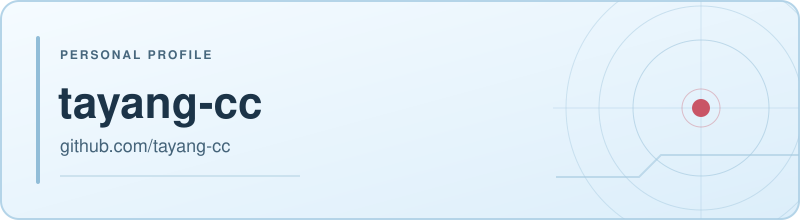

<h1 align="center">Welcome to tayang-cc's profile</h1>

  

<h2 align="center">About me</h2>

Hi, I'm <strong>tayang-cc</strong>.

Welcome to my little corner of GitHub.

<ul>
  <li><strong>Name:</strong> tayang-cc</li>
  <li><strong>GitHub:</strong> <a href="https://github.com/tayang-cc">@tayang-cc</a></li>
  <li><strong>Repositories:</strong> <a href="https://github.com/tayang-cc?tab=repositories">Explore my projects</a></li>
</ul>

 

---

<h2 align="center">Interests</h2>

  <code>LLM agents</code> · <code>Post-training</code> · <code>Agent harnesses</code> · <code>Agentic RL</code>

<h2 align="center">Currently learning</h2>

- **LLM agents** — Reasoning, tool use, and agent orchestration.
- **Post-training** — Methods for improving model behavior after pretraining.
- **Agent harnesses** — Infrastructure for running and evaluating agents.
- **Agentic RL** — Reinforcement learning for agent behavior.

---

<h3 align="center">Thanks for visiting</h3>

  GIF: <a href="https://gifs.alphacoders.com/gifs/view/112778">Rei Ayanami · Neon Genesis Evangelion</a>

